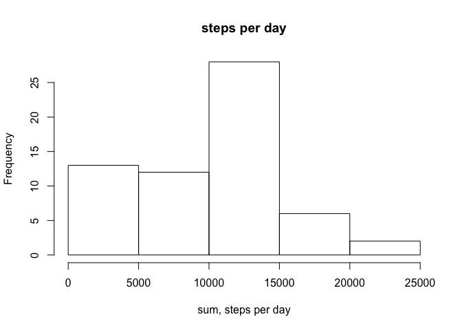
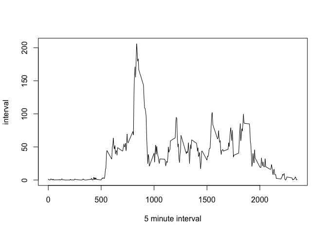
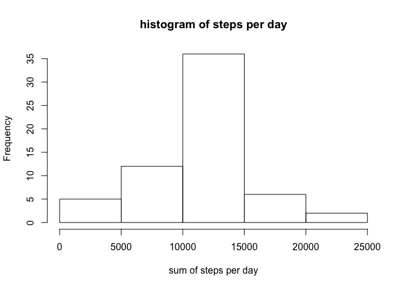
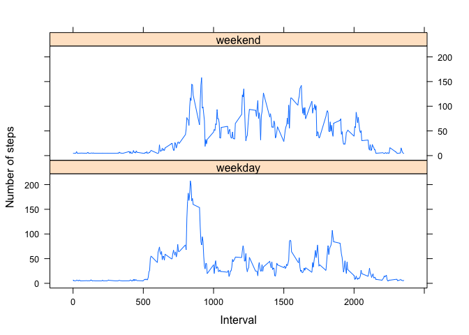

Set global options: 

```r
knitr::opts_chunk$set(echo = TRUE)
```

Reproducible research_1 
==============================
(#steps #median #mean #maximum #plot)

#Loading and preprocessing the data
Load the data

```r
knitr::opts_chunk$set(echo = TRUE)
setwd("~/Library/Mobile Documents/com~apple~CloudDocs/study_files/coursera/5. Reproducible Research")
data <- read.csv("activity.csv", header = T, sep = ",")
View(data)
```

##What is mean total number of steps taken per day?
1. Calculate the total number of steps taken per day
2. Make a histogram of the total number of steps taken each day

```r
library(plyr)
library(dplyr)
```

```
## 
## Attaching package: 'dplyr'
```

```
## The following objects are masked from 'package:plyr':
## 
##     arrange, count, desc, failwith, id, mutate, rename, summarise,
##     summarize
```

```
## The following objects are masked from 'package:stats':
## 
##     filter, lag
```

```
## The following objects are masked from 'package:base':
## 
##     intersect, setdiff, setequal, union
```

```r
sum <- tapply(data$steps, data$date, sum, na.rm = T)
hist(sum, xlab = "sum, steps per day", main = "steps per day")
```

<!-- -->

3. Calculate and report the mean and median of the total number of steps taken per day

```r
mean_sum <- mean(sum)
median_sum <- median(sum)
result1 <- c("the mean is", mean_sum)
result2 <- c("the median is", median_sum)
paste(result1, collapse = " ")
```

```
## [1] "the mean is 9354.22950819672"
```

```r
paste(result2, collapse = " ")
```

```
## [1] "the median is 10395"
```


##What is the average daily activity pattern?
1. Make a time series plot (i.e. 𝚝𝚢𝚙𝚎 = "𝚕") of the 5-minute interval (x-axis) and the average number of steps taken, averaged across all days (y-axis)

```r
interval <- tapply(data$steps, data$interval, mean, na.rm=T)
View(interval)
plot(interval ~ unique(data$interval), type="l", xlab= "5 minute interval")
```

<!-- -->

2. Which 5-minute interval, on average across all the days in the dataset, contains the maximum number of steps?

```r
interval[which.max(interval)]
```

```
##      835 
## 206.1698
```

##Imputing Missing Values
1.Calculate and report the total number of missing values in the dataset (i.e. the total number of rows with 𝙽𝙰s)

```r
table(is.na(data))
```

```
## 
## FALSE  TRUE 
## 50400  2304
```

2. Devise a strategy for filling in all of the missing values in the dataset. The strategy does not need to be sophisticated. For example, you could use the mean/median for that day, or the mean for that 5-minute interval, etc.
**strategy chosen: fill in with the mean 
3. Create a new dataset that is equal to the original dataset but with the missing data filled in.

```r
data$steps[is.na(data$steps)] <- mean(data$steps, na.rm = T)
```

4. Make a histogram of the total number of steps taken each day and Calculate and report the mean and median total number of steps taken per day.

```r
data2 <- tapply(data$steps, data$date, sum, na.rm= T)
hist(data2, xlab = "sum of steps per day", main = "histogram of steps per day")
```

<!-- -->

```r
mean_data2 <- mean(data2)
median_data2 <- median(data2)
result3 <- c("the mean is", mean_data2)
result4 <- c("the median is", median_data2)
paste(result3, collapse = " ")
```

```
## [1] "the mean is 10766.1886792453"
```

```r
paste(result4, collapse = " ")
```

```
## [1] "the median is 10766.1886792453"
```

Do these values differ from the estimates from the first part of the assignment? 

```r
df_summary <- rbind(data.frame(mean = c(mean_sum, mean_data2), median = c(median_sum, median_data2)))
rownames(df_summary) <- c("with NA's", "without NA's")
print(df_summary)
```

```
##                  mean   median
## with NA's     9354.23 10395.00
## without NA's 10766.19 10766.19
```
Q: What is the impact of imputing missing data on the estimates of the total daily number of steps?
A: it becomes less skewed after imputing missing value with mean value of steps.

##Are there differences in activity patterns between weekdays and weekends?

1. Create a new factor variable in the dataset with two levels – “weekday” and “weekend” indicating whether a given date is a weekday or weekend day.

```r
data$date <- as.Date(data$date)
data$weekdays <- weekdays(data$date)
data$weekdays[c(data$weekdays == "Saturday" | data$weekdays == "Sunday")] <- "weekend"
data$weekdays[!data$weekdays == "weekend"] <- "weekday"
week_summary <- ddply(data, c("interval", "weekdays"), function(x) apply(x[1], 
                                                                         2, mean))
head(week_summary)
```

```
##   interval weekdays    steps
## 1        0  weekday 7.006569
## 2        0  weekend 4.672825
## 3        5  weekday 5.384347
## 4        5  weekend 4.672825
## 5       10  weekday 5.139902
## 6       10  weekend 4.672825
```

2. Make a panel plot containing a time series plot (i.e. 𝚝𝚢𝚙𝚎 = "𝚕") of the 5-minute interval (x-axis) and the average number of steps taken, averaged across all weekday days or weekend days (y-axis). See the README file in the GitHub repository to see an example of what this plot should look like using simulated data.

```r
library(lattice)
xyplot(week_summary$steps ~ week_summary$interval | week_summary$weekdays,
       type="l", 
       lwd=1, 
       xlab="Interval", 
       ylab="Number of steps", 
       layout=c(1,2))
```

<!-- -->
